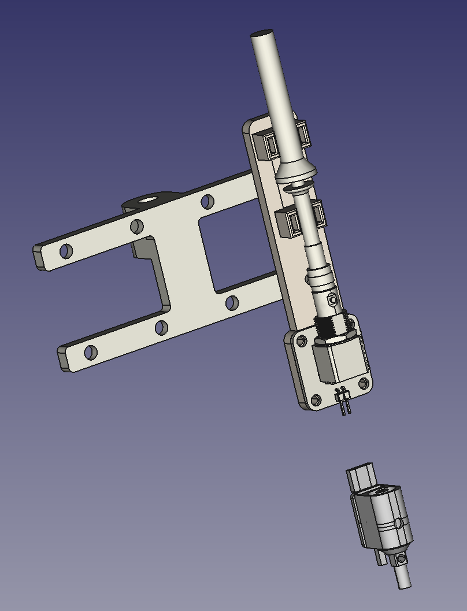

## flex-fixture
Oscilloscope fixture to ease in simple probing without causing undue mess on the workspace. It allows me to more quickly switch between projects and to clean up after by moving the probe boom out of the way. In addition each probe can be plugged directly into Saleae Pro 8 for logic analysis.

### COTS Components
* [Boom microphone mount](https://www.amazon.com/gp/product/B07V2FJL54/ref=ppx_yo_dt_b_asin_title_o07_s00?ie=UTF8&psc=1)
* [5/8 to 3/8" adapter](https://www.amazon.com/Donuts-Adapter-Female-Knurled-Microphone/dp/B08VGTCZWN)
* [Magnetic mount PCB holder + flex arms](https://www.aliexpress.us/item/2251832832414460.html)
* [P100 pogo pins](https://www.amazon.com/gp/product/B017N4Y79U)
* [P100 pogo pins](https://www.amazon.com/gp/product/B018HMJKRG)
* [P100 pogo pin receptacle](https://www.amazon.com/Spring-Probe-Sleeve-Accessory-R125%E2%80%914s/dp/B0B6PNLFZ7)
* [CONBNC002](https://www.mouser.com/ProductDetail/Linx-Technologies/CONBNC002)
* Probe to BNC adapter (typically included with oscope probes)
* Twisted pair wire from CAT5 cable
* Zip ties to mount o-scope probe to probe mount
* M5 screws to mount probe mount to boom mount
* M4 screws to mount PCBs to 3d printed parts
* M4/M5 tap for 3d printed parts
* Recommended resin is Sirayatech blu

### 3D printed parts
* Boom mount
* Oscilloscope probe attachment (1 per channel)
* Flex arm mount

### PCBs (combined with mouse bite)
* Probe -> BNC -> 0.1" conversion
* Pogo pin -> 0.1"

